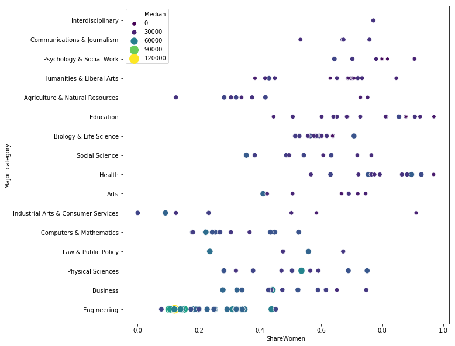

# College Majors Data
__Source:__ https://github.com/fivethirtyeight/data/tree/master/college-majors
 
 

This is the data behind the story [The Economic Guide To Picking A College Major](https://fivethirtyeight.com/features/the-economic-guide-to-picking-a-college-major/). Data on college majors comes from the American Community Survey from 2010-2012. The datasets contain basic earnings and labor force information. The recent-grads.csv data, contains detailed information by gender and the type of job graduates got. The women-stem.csv data is a subset of recent-grads.csv for women in STEM fields, and it contains data for scatter plot in associated DataLab post on women in science/technology jobs. (Small easter egg - someone made a [shiny app](https://bencasselman.shinyapps.io/new-test/) visualizing this data.). 

Note that there are other datasets available. The grad-students.csv contains details on graduate school attendees only, while all-ages.csv contains undergraduates from recent-grads.csv and graduate students. If you're interested in using these other datasets, you'll need to find the _raw_ URLs from github to read them in. You can find these by clicking on [all-ages.csv](https://github.com/fivethirtyeight/data/blob/master/college-majors/all-ages.csv) or [grad-students.csv](https://github.com/fivethirtyeight/data/blob/master/college-majors/grad-students.csv) on the main github page for the project. Then, click on the "raw" button, and use the URL in the pandas.read_csv() command (the URLs begin with raw.githubusercontent).

Major categories are from Carnevale et al, ["What's It Worth?: The Economic Value of College Majors."](http://cew.georgetown.edu/whatsitworth) Georgetown University Center on Education and the Workforce, 2011. 

We can read the data directly from github. See additional details about the dataset [here](https://github.com/fivethirtyeight/data/tree/master/college-majors).

<table border="1" class="dataframe">
  <thead>
    <tr style="text-align: right;">
      <th></th>
      <th>Rank</th>
      <th>Major_code</th>
      <th>Major</th>
      <th>Total</th>
      <th>Men</th>
      <th>Women</th>
      <th>Major_category</th>
      <th>ShareWomen</th>
      <th>Sample_size</th>
      <th>Employed</th>
      <th>Full_time</th>
      <th>Part_time</th>
      <th>Full_time_year_round</th>
      <th>Unemployed</th>
      <th>Unemployment_rate</th>
      <th>Median</th>
      <th>P25th</th>
      <th>P75th</th>
      <th>College_jobs</th>
      <th>Non_college_jobs</th>
      <th>Low_wage_jobs</th>
    </tr>
  </thead>
  <tbody>
    <tr>
      <th>0</th>
      <td>1</td>
      <td>2419</td>
      <td>PETROLEUM ENGINEERING</td>
      <td>2339.0</td>
      <td>2057.0</td>
      <td>282.0</td>
      <td>Engineering</td>
      <td>0.120564</td>
      <td>36</td>
      <td>1976</td>
      <td>1849</td>
      <td>270</td>
      <td>1207</td>
      <td>37</td>
      <td>0.018381</td>
      <td>110000</td>
      <td>95000</td>
      <td>125000</td>
      <td>1534</td>
      <td>364</td>
      <td>193</td>
    </tr>
    <tr>
      <th>1</th>
      <td>2</td>
      <td>2416</td>
      <td>MINING AND MINERAL ENGINEERING</td>
      <td>756.0</td>
      <td>679.0</td>
      <td>77.0</td>
      <td>Engineering</td>
      <td>0.101852</td>
      <td>7</td>
      <td>640</td>
      <td>556</td>
      <td>170</td>
      <td>388</td>
      <td>85</td>
      <td>0.117241</td>
      <td>75000</td>
      <td>55000</td>
      <td>90000</td>
      <td>350</td>
      <td>257</td>
      <td>50</td>
    </tr>
    <tr>
      <th>2</th>
      <td>3</td>
      <td>2415</td>
      <td>METALLURGICAL ENGINEERING</td>
      <td>856.0</td>
      <td>725.0</td>
      <td>131.0</td>
      <td>Engineering</td>
      <td>0.153037</td>
      <td>3</td>
      <td>648</td>
      <td>558</td>
      <td>133</td>
      <td>340</td>
      <td>16</td>
      <td>0.024096</td>
      <td>73000</td>
      <td>50000</td>
      <td>105000</td>
      <td>456</td>
      <td>176</td>
      <td>0</td>
    </tr>
    <tr>
      <th>3</th>
      <td>4</td>
      <td>2417</td>
      <td>NAVAL ARCHITECTURE AND MARINE ENGINEERING</td>
      <td>1258.0</td>
      <td>1123.0</td>
      <td>135.0</td>
      <td>Engineering</td>
      <td>0.107313</td>
      <td>16</td>
      <td>758</td>
      <td>1069</td>
      <td>150</td>
      <td>692</td>
      <td>40</td>
      <td>0.050125</td>
      <td>70000</td>
      <td>43000</td>
      <td>80000</td>
      <td>529</td>
      <td>102</td>
      <td>0</td>
    </tr>
    <tr>
      <th>4</th>
      <td>5</td>
      <td>2405</td>
      <td>CHEMICAL ENGINEERING</td>
      <td>32260.0</td>
      <td>21239.0</td>
      <td>11021.0</td>
      <td>Engineering</td>
      <td>0.341631</td>
      <td>289</td>
      <td>25694</td>
      <td>23170</td>
      <td>5180</td>
      <td>16697</td>
      <td>1672</td>
      <td>0.061098</td>
      <td>65000</td>
      <td>50000</td>
      <td>75000</td>
      <td>18314</td>
      <td>4440</td>
      <td>972</td>
    </tr>
    <tr>
      <th>5</th>
      <td>6</td>
      <td>2418</td>
      <td>NUCLEAR ENGINEERING</td>
      <td>2573.0</td>
      <td>2200.0</td>
      <td>373.0</td>
      <td>Engineering</td>
      <td>0.144967</td>
      <td>17</td>
      <td>1857</td>
      <td>2038</td>
      <td>264</td>
      <td>1449</td>
      <td>400</td>
      <td>0.177226</td>
      <td>65000</td>
      <td>50000</td>
      <td>102000</td>
      <td>1142</td>
      <td>657</td>
      <td>244</td>
    </tr>
    <tr>
      <th>6</th>
      <td>7</td>
      <td>6202</td>
      <td>ACTUARIAL SCIENCE</td>
      <td>3777.0</td>
      <td>2110.0</td>
      <td>1667.0</td>
      <td>Business</td>
      <td>0.441356</td>
      <td>51</td>
      <td>2912</td>
      <td>2924</td>
      <td>296</td>
      <td>2482</td>
      <td>308</td>
      <td>0.095652</td>
      <td>62000</td>
      <td>53000</td>
      <td>72000</td>
      <td>1768</td>
      <td>314</td>
      <td>259</td>
    </tr>
    <tr>
      <th>7</th>
      <td>8</td>
      <td>5001</td>
      <td>ASTRONOMY AND ASTROPHYSICS</td>
      <td>1792.0</td>
      <td>832.0</td>
      <td>960.0</td>
      <td>Physical Sciences</td>
      <td>0.535714</td>
      <td>10</td>
      <td>1526</td>
      <td>1085</td>
      <td>553</td>
      <td>827</td>
      <td>33</td>
      <td>0.021167</td>
      <td>62000</td>
      <td>31500</td>
      <td>109000</td>
      <td>972</td>
      <td>500</td>
      <td>220</td>
    </tr>
    <tr>
      <th>8</th>
      <td>9</td>
      <td>2414</td>
      <td>MECHANICAL ENGINEERING</td>
      <td>91227.0</td>
      <td>80320.0</td>
      <td>10907.0</td>
      <td>Engineering</td>
      <td>0.119559</td>
      <td>1029</td>
      <td>76442</td>
      <td>71298</td>
      <td>13101</td>
      <td>54639</td>
      <td>4650</td>
      <td>0.057342</td>
      <td>60000</td>
      <td>48000</td>
      <td>70000</td>
      <td>52844</td>
      <td>16384</td>
      <td>3253</td>
    </tr>
    <tr>
      <th>9</th>
      <td>10</td>
      <td>2408</td>
      <td>ELECTRICAL ENGINEERING</td>
      <td>81527.0</td>
      <td>65511.0</td>
      <td>16016.0</td>
      <td>Engineering</td>
      <td>0.196450</td>
      <td>631</td>
      <td>61928</td>
      <td>55450</td>
      <td>12695</td>
      <td>41413</td>
      <td>3895</td>
      <td>0.059174</td>
      <td>60000</td>
      <td>45000</td>
      <td>72000</td>
      <td>45829</td>
      <td>10874</td>
      <td>3170</td>
    </tr>
    <tr>
      <th>10</th>
      <td>11</td>
      <td>2407</td>
      <td>COMPUTER ENGINEERING</td>
      <td>41542.0</td>
      <td>33258.0</td>
      <td>8284.0</td>
      <td>Engineering</td>
      <td>0.199413</td>
      <td>399</td>
      <td>32506</td>
      <td>30315</td>
      <td>5146</td>
      <td>23621</td>
      <td>2275</td>
      <td>0.065409</td>
      <td>60000</td>
      <td>45000</td>
      <td>75000</td>
      <td>23694</td>
      <td>5721</td>
      <td>980</td>
    </tr>
    <tr>
      <th>11</th>
      <td>12</td>
      <td>2401</td>
      <td>AEROSPACE ENGINEERING</td>
      <td>15058.0</td>
      <td>12953.0</td>
      <td>2105.0</td>
      <td>Engineering</td>
      <td>0.139793</td>
      <td>147</td>
      <td>11391</td>
      <td>11106</td>
      <td>2724</td>
      <td>8790</td>
      <td>794</td>
      <td>0.065162</td>
      <td>60000</td>
      <td>42000</td>
      <td>70000</td>
      <td>8184</td>
      <td>2425</td>
      <td>372</td>
    </tr>
    <tr>
      <th>12</th>
      <td>13</td>
      <td>2404</td>
      <td>BIOMEDICAL ENGINEERING</td>
      <td>14955.0</td>
      <td>8407.0</td>
      <td>6548.0</td>
      <td>Engineering</td>
      <td>0.437847</td>
      <td>79</td>
      <td>10047</td>
      <td>9017</td>
      <td>2694</td>
      <td>5986</td>
      <td>1019</td>
      <td>0.092084</td>
      <td>60000</td>
      <td>36000</td>
      <td>70000</td>
      <td>6439</td>
      <td>2471</td>
      <td>789</td>
    </tr>
    <tr>
      <th>13</th>
      <td>14</td>
      <td>5008</td>
      <td>MATERIALS SCIENCE</td>
      <td>4279.0</td>
      <td>2949.0</td>
      <td>1330.0</td>
      <td>Engineering</td>
      <td>0.310820</td>
      <td>22</td>
      <td>3307</td>
      <td>2751</td>
      <td>878</td>
      <td>1967</td>
      <td>78</td>
      <td>0.023043</td>
      <td>60000</td>
      <td>39000</td>
      <td>65000</td>
      <td>2626</td>
      <td>391</td>
      <td>81</td>
    </tr>
    <tr>
      <th>14</th>
      <td>15</td>
      <td>2409</td>
      <td>ENGINEERING MECHANICS PHYSICS AND SCIENCE</td>
      <td>4321.0</td>
      <td>3526.0</td>
      <td>795.0</td>
      <td>Engineering</td>
      <td>0.183985</td>
      <td>30</td>
      <td>3608</td>
      <td>2999</td>
      <td>811</td>
      <td>2004</td>
      <td>23</td>
      <td>0.006334</td>
      <td>58000</td>
      <td>25000</td>
      <td>74000</td>
      <td>2439</td>
      <td>947</td>
      <td>263</td>
    </tr>
    <tr>
      <th>15</th>
      <td>16</td>
      <td>2402</td>
      <td>BIOLOGICAL ENGINEERING</td>
      <td>8925.0</td>
      <td>6062.0</td>
      <td>2863.0</td>
      <td>Engineering</td>
      <td>0.320784</td>
      <td>55</td>
      <td>6170</td>
      <td>5455</td>
      <td>1983</td>
      <td>3413</td>
      <td>589</td>
      <td>0.087143</td>
      <td>57100</td>
      <td>40000</td>
      <td>76000</td>
      <td>3603</td>
      <td>1595</td>
      <td>524</td>
    </tr>
    <tr>
      <th>16</th>
      <td>17</td>
      <td>2412</td>
      <td>INDUSTRIAL AND MANUFACTURING ENGINEERING</td>
      <td>18968.0</td>
      <td>12453.0</td>
      <td>6515.0</td>
      <td>Engineering</td>
      <td>0.343473</td>
      <td>183</td>
      <td>15604</td>
      <td>14879</td>
      <td>2243</td>
      <td>11326</td>
      <td>699</td>
      <td>0.042876</td>
      <td>57000</td>
      <td>37900</td>
      <td>67000</td>
      <td>8306</td>
      <td>3235</td>
      <td>640</td>
    </tr>
    <tr>
      <th>17</th>
      <td>18</td>
      <td>2400</td>
      <td>GENERAL ENGINEERING</td>
      <td>61152.0</td>
      <td>45683.0</td>
      <td>15469.0</td>
      <td>Engineering</td>
      <td>0.252960</td>
      <td>425</td>
      <td>44931</td>
      <td>41235</td>
      <td>7199</td>
      <td>33540</td>
      <td>2859</td>
      <td>0.059824</td>
      <td>56000</td>
      <td>36000</td>
      <td>69000</td>
      <td>26898</td>
      <td>11734</td>
      <td>3192</td>
    </tr>
    <tr>
      <th>18</th>
      <td>19</td>
      <td>2403</td>
      <td>ARCHITECTURAL ENGINEERING</td>
      <td>2825.0</td>
      <td>1835.0</td>
      <td>990.0</td>
      <td>Engineering</td>
      <td>0.350442</td>
      <td>26</td>
      <td>2575</td>
      <td>2277</td>
      <td>343</td>
      <td>1848</td>
      <td>170</td>
      <td>0.061931</td>
      <td>54000</td>
      <td>38000</td>
      <td>65000</td>
      <td>1665</td>
      <td>649</td>
      <td>137</td>
    </tr>
    <tr>
      <th>19</th>
      <td>20</td>
      <td>3201</td>
      <td>COURT REPORTING</td>
      <td>1148.0</td>
      <td>877.0</td>
      <td>271.0</td>
      <td>Law &amp; Public Policy</td>
      <td>0.236063</td>
      <td>14</td>
      <td>930</td>
      <td>808</td>
      <td>223</td>
      <td>808</td>
      <td>11</td>
      <td>0.011690</td>
      <td>54000</td>
      <td>50000</td>
      <td>54000</td>
      <td>402</td>
      <td>528</td>
      <td>144</td>
    </tr>
    <tr>
      <th>20</th>
      <td>21</td>
      <td>2102</td>
      <td>COMPUTER SCIENCE</td>
      <td>128319.0</td>
      <td>99743.0</td>
      <td>28576.0</td>
      <td>Computers &amp; Mathematics</td>
      <td>0.222695</td>
      <td>1196</td>
      <td>102087</td>
      <td>91485</td>
      <td>18726</td>
      <td>70932</td>
      <td>6884</td>
      <td>0.063173</td>
      <td>53000</td>
      <td>39000</td>
      <td>70000</td>
      <td>68622</td>
      <td>25667</td>
      <td>5144</td>
    </tr>
    <tr>
      <th>21</th>
      <td>22</td>
      <td>1104</td>
      <td>FOOD SCIENCE</td>
      <td>NaN</td>
      <td>NaN</td>
      <td>NaN</td>
      <td>Agriculture &amp; Natural Resources</td>
      <td>NaN</td>
      <td>36</td>
      <td>3149</td>
      <td>2558</td>
      <td>1121</td>
      <td>1735</td>
      <td>338</td>
      <td>0.096931</td>
      <td>53000</td>
      <td>32000</td>
      <td>70000</td>
      <td>1183</td>
      <td>1274</td>
      <td>485</td>
    </tr>
    <tr>
      <th>22</th>
      <td>23</td>
      <td>2502</td>
      <td>ELECTRICAL ENGINEERING TECHNOLOGY</td>
      <td>11565.0</td>
      <td>8181.0</td>
      <td>3384.0</td>
      <td>Engineering</td>
      <td>0.292607</td>
      <td>97</td>
      <td>8587</td>
      <td>7530</td>
      <td>1873</td>
      <td>5681</td>
      <td>824</td>
      <td>0.087557</td>
      <td>52000</td>
      <td>35000</td>
      <td>60000</td>
      <td>5126</td>
      <td>2686</td>
      <td>696</td>
    </tr>
    <tr>
      <th>23</th>
      <td>24</td>
      <td>2413</td>
      <td>MATERIALS ENGINEERING AND MATERIALS SCIENCE</td>
      <td>2993.0</td>
      <td>2020.0</td>
      <td>973.0</td>
      <td>Engineering</td>
      <td>0.325092</td>
      <td>22</td>
      <td>2449</td>
      <td>1658</td>
      <td>1040</td>
      <td>1151</td>
      <td>70</td>
      <td>0.027789</td>
      <td>52000</td>
      <td>35000</td>
      <td>62000</td>
      <td>1911</td>
      <td>305</td>
      <td>70</td>
    </tr>
    <tr>
      <th>24</th>
      <td>25</td>
      <td>6212</td>
      <td>MANAGEMENT INFORMATION SYSTEMS AND STATISTICS</td>
      <td>18713.0</td>
      <td>13496.0</td>
      <td>5217.0</td>
      <td>Business</td>
      <td>0.278790</td>
      <td>278</td>
      <td>16413</td>
      <td>15141</td>
      <td>2420</td>
      <td>13017</td>
      <td>1015</td>
      <td>0.058240</td>
      <td>51000</td>
      <td>38000</td>
      <td>60000</td>
      <td>6342</td>
      <td>5741</td>
      <td>708</td>
    </tr>
    <tr>
      <th>25</th>
      <td>26</td>
      <td>2406</td>
      <td>CIVIL ENGINEERING</td>
      <td>53153.0</td>
      <td>41081.0</td>
      <td>12072.0</td>
      <td>Engineering</td>
      <td>0.227118</td>
      <td>565</td>
      <td>43041</td>
      <td>38302</td>
      <td>10080</td>
      <td>29196</td>
      <td>3270</td>
      <td>0.070610</td>
      <td>50000</td>
      <td>40000</td>
      <td>60000</td>
      <td>28526</td>
      <td>9356</td>
      <td>2899</td>
    </tr>
    <tr>
      <th>26</th>
      <td>27</td>
      <td>5601</td>
      <td>CONSTRUCTION SERVICES</td>
      <td>18498.0</td>
      <td>16820.0</td>
      <td>1678.0</td>
      <td>Industrial Arts &amp; Consumer Services</td>
      <td>0.090713</td>
      <td>295</td>
      <td>16318</td>
      <td>15690</td>
      <td>1751</td>
      <td>12313</td>
      <td>1042</td>
      <td>0.060023</td>
      <td>50000</td>
      <td>36000</td>
      <td>60000</td>
      <td>3275</td>
      <td>5351</td>
      <td>703</td>
    </tr>
    <tr>
      <th>27</th>
      <td>28</td>
      <td>6204</td>
      <td>OPERATIONS LOGISTICS AND E-COMMERCE</td>
      <td>11732.0</td>
      <td>7921.0</td>
      <td>3811.0</td>
      <td>Business</td>
      <td>0.324838</td>
      <td>156</td>
      <td>10027</td>
      <td>9639</td>
      <td>1183</td>
      <td>7724</td>
      <td>504</td>
      <td>0.047859</td>
      <td>50000</td>
      <td>40000</td>
      <td>60000</td>
      <td>1466</td>
      <td>3629</td>
      <td>285</td>
    </tr>
    <tr>
      <th>28</th>
      <td>29</td>
      <td>2499</td>
      <td>MISCELLANEOUS ENGINEERING</td>
      <td>9133.0</td>
      <td>7398.0</td>
      <td>1735.0</td>
      <td>Engineering</td>
      <td>0.189970</td>
      <td>118</td>
      <td>7428</td>
      <td>6811</td>
      <td>1662</td>
      <td>5476</td>
      <td>597</td>
      <td>0.074393</td>
      <td>50000</td>
      <td>39000</td>
      <td>65000</td>
      <td>3445</td>
      <td>2426</td>
      <td>365</td>
    </tr>
    <tr>
      <th>29</th>
      <td>30</td>
      <td>5402</td>
      <td>PUBLIC POLICY</td>
      <td>5978.0</td>
      <td>2639.0</td>
      <td>3339.0</td>
      <td>Law &amp; Public Policy</td>
      <td>0.558548</td>
      <td>55</td>
      <td>4547</td>
      <td>4163</td>
      <td>1306</td>
      <td>2776</td>
      <td>670</td>
      <td>0.128426</td>
      <td>50000</td>
      <td>35000</td>
      <td>70000</td>
      <td>1550</td>
      <td>1871</td>
      <td>340</td>
    </tr>
    <tr>
      <th>...</th>
      <td>...</td>
      <td>...</td>
      <td>...</td>
      <td>...</td>
      <td>...</td>
      <td>...</td>
      <td>...</td>
      <td>...</td>
      <td>...</td>
      <td>...</td>
      <td>...</td>
      <td>...</td>
      <td>...</td>
      <td>...</td>
      <td>...</td>
      <td>...</td>
      <td>...</td>
      <td>...</td>
      <td>...</td>
      <td>...</td>
      <td>...</td>
    </tr>
    <tr>
      <th>70</th>
      <td>71</td>
      <td>5205</td>
      <td>INDUSTRIAL AND ORGANIZATIONAL PSYCHOLOGY</td>
      <td>3014.0</td>
      <td>1075.0</td>
      <td>1939.0</td>
      <td>Psychology &amp; Social Work</td>
      <td>0.643331</td>
      <td>24</td>
      <td>2343</td>
      <td>1644</td>
      <td>1095</td>
      <td>1409</td>
      <td>286</td>
      <td>0.108787</td>
      <td>40000</td>
      <td>32000</td>
      <td>53000</td>
      <td>559</td>
      <td>1224</td>
      <td>272</td>
    </tr>
    <tr>
      <th>71</th>
      <td>72</td>
      <td>1102</td>
      <td>AGRICULTURAL ECONOMICS</td>
      <td>2439.0</td>
      <td>1749.0</td>
      <td>690.0</td>
      <td>Agriculture &amp; Natural Resources</td>
      <td>0.282903</td>
      <td>44</td>
      <td>2174</td>
      <td>1819</td>
      <td>620</td>
      <td>1528</td>
      <td>182</td>
      <td>0.077250</td>
      <td>40000</td>
      <td>27000</td>
      <td>54000</td>
      <td>535</td>
      <td>893</td>
      <td>94</td>
    </tr>
    <tr>
      <th>72</th>
      <td>73</td>
      <td>5000</td>
      <td>PHYSICAL SCIENCES</td>
      <td>1436.0</td>
      <td>894.0</td>
      <td>542.0</td>
      <td>Physical Sciences</td>
      <td>0.377437</td>
      <td>10</td>
      <td>1146</td>
      <td>768</td>
      <td>437</td>
      <td>653</td>
      <td>42</td>
      <td>0.035354</td>
      <td>40000</td>
      <td>30000</td>
      <td>55000</td>
      <td>530</td>
      <td>465</td>
      <td>269</td>
    </tr>
    <tr>
      <th>73</th>
      <td>74</td>
      <td>3801</td>
      <td>MILITARY TECHNOLOGIES</td>
      <td>124.0</td>
      <td>124.0</td>
      <td>0.0</td>
      <td>Industrial Arts &amp; Consumer Services</td>
      <td>0.000000</td>
      <td>4</td>
      <td>0</td>
      <td>111</td>
      <td>0</td>
      <td>111</td>
      <td>0</td>
      <td>0.000000</td>
      <td>40000</td>
      <td>40000</td>
      <td>40000</td>
      <td>0</td>
      <td>0</td>
      <td>0</td>
    </tr>
    <tr>
      <th>74</th>
      <td>75</td>
      <td>5003</td>
      <td>CHEMISTRY</td>
      <td>66530.0</td>
      <td>32923.0</td>
      <td>33607.0</td>
      <td>Physical Sciences</td>
      <td>0.505141</td>
      <td>353</td>
      <td>48535</td>
      <td>39509</td>
      <td>15066</td>
      <td>29910</td>
      <td>2769</td>
      <td>0.053972</td>
      <td>39000</td>
      <td>30000</td>
      <td>49900</td>
      <td>30382</td>
      <td>14718</td>
      <td>4288</td>
    </tr>
    <tr>
      <th>75</th>
      <td>76</td>
      <td>5701</td>
      <td>ELECTRICAL, MECHANICAL, AND PRECISION TECHNOLO...</td>
      <td>2435.0</td>
      <td>1869.0</td>
      <td>566.0</td>
      <td>Industrial Arts &amp; Consumer Services</td>
      <td>0.232444</td>
      <td>37</td>
      <td>2107</td>
      <td>2057</td>
      <td>287</td>
      <td>1752</td>
      <td>64</td>
      <td>0.029480</td>
      <td>38400</td>
      <td>22500</td>
      <td>45000</td>
      <td>221</td>
      <td>1659</td>
      <td>81</td>
    </tr>
    <tr>
      <th>76</th>
      <td>77</td>
      <td>6203</td>
      <td>BUSINESS MANAGEMENT AND ADMINISTRATION</td>
      <td>329927.0</td>
      <td>173809.0</td>
      <td>156118.0</td>
      <td>Business</td>
      <td>0.473190</td>
      <td>4212</td>
      <td>276234</td>
      <td>251540</td>
      <td>50357</td>
      <td>199897</td>
      <td>21502</td>
      <td>0.072218</td>
      <td>38000</td>
      <td>29000</td>
      <td>50000</td>
      <td>36720</td>
      <td>148395</td>
      <td>32395</td>
    </tr>
    <tr>
      <th>77</th>
      <td>78</td>
      <td>6206</td>
      <td>MARKETING AND MARKETING RESEARCH</td>
      <td>205211.0</td>
      <td>78857.0</td>
      <td>126354.0</td>
      <td>Business</td>
      <td>0.615727</td>
      <td>2684</td>
      <td>178862</td>
      <td>156668</td>
      <td>35829</td>
      <td>127230</td>
      <td>11663</td>
      <td>0.061215</td>
      <td>38000</td>
      <td>30000</td>
      <td>50000</td>
      <td>25320</td>
      <td>93889</td>
      <td>27968</td>
    </tr>
    <tr>
      <th>78</th>
      <td>79</td>
      <td>5506</td>
      <td>POLITICAL SCIENCE AND GOVERNMENT</td>
      <td>182621.0</td>
      <td>93880.0</td>
      <td>88741.0</td>
      <td>Social Science</td>
      <td>0.485930</td>
      <td>1387</td>
      <td>133454</td>
      <td>117709</td>
      <td>43711</td>
      <td>83236</td>
      <td>15022</td>
      <td>0.101175</td>
      <td>38000</td>
      <td>28000</td>
      <td>50000</td>
      <td>36854</td>
      <td>66947</td>
      <td>19803</td>
    </tr>
    <tr>
      <th>79</th>
      <td>80</td>
      <td>5504</td>
      <td>GEOGRAPHY</td>
      <td>18480.0</td>
      <td>11404.0</td>
      <td>7076.0</td>
      <td>Social Science</td>
      <td>0.382900</td>
      <td>179</td>
      <td>14057</td>
      <td>11367</td>
      <td>5651</td>
      <td>8628</td>
      <td>1799</td>
      <td>0.113459</td>
      <td>38000</td>
      <td>30000</td>
      <td>50000</td>
      <td>5350</td>
      <td>6830</td>
      <td>1905</td>
    </tr>
    <tr>
      <th>80</th>
      <td>81</td>
      <td>3606</td>
      <td>MICROBIOLOGY</td>
      <td>15232.0</td>
      <td>6383.0</td>
      <td>8849.0</td>
      <td>Biology &amp; Life Science</td>
      <td>0.580948</td>
      <td>62</td>
      <td>9685</td>
      <td>7453</td>
      <td>3379</td>
      <td>5080</td>
      <td>693</td>
      <td>0.066776</td>
      <td>38000</td>
      <td>29600</td>
      <td>50000</td>
      <td>5577</td>
      <td>3174</td>
      <td>1246</td>
    </tr>
    <tr>
      <th>81</th>
      <td>82</td>
      <td>2106</td>
      <td>COMPUTER ADMINISTRATION MANAGEMENT AND SECURITY</td>
      <td>8066.0</td>
      <td>6607.0</td>
      <td>1459.0</td>
      <td>Computers &amp; Mathematics</td>
      <td>0.180883</td>
      <td>103</td>
      <td>6509</td>
      <td>6289</td>
      <td>1030</td>
      <td>4936</td>
      <td>721</td>
      <td>0.099723</td>
      <td>37500</td>
      <td>25000</td>
      <td>50000</td>
      <td>2354</td>
      <td>3244</td>
      <td>308</td>
    </tr>
    <tr>
      <th>82</th>
      <td>83</td>
      <td>3601</td>
      <td>BIOCHEMICAL SCIENCES</td>
      <td>39107.0</td>
      <td>18951.0</td>
      <td>20156.0</td>
      <td>Biology &amp; Life Science</td>
      <td>0.515406</td>
      <td>174</td>
      <td>25678</td>
      <td>20643</td>
      <td>9948</td>
      <td>13785</td>
      <td>2249</td>
      <td>0.080531</td>
      <td>37400</td>
      <td>29000</td>
      <td>50000</td>
      <td>15654</td>
      <td>8394</td>
      <td>3012</td>
    </tr>
    <tr>
      <th>83</th>
      <td>84</td>
      <td>3602</td>
      <td>BOTANY</td>
      <td>1329.0</td>
      <td>626.0</td>
      <td>703.0</td>
      <td>Biology &amp; Life Science</td>
      <td>0.528969</td>
      <td>9</td>
      <td>1010</td>
      <td>946</td>
      <td>169</td>
      <td>740</td>
      <td>0</td>
      <td>0.000000</td>
      <td>37000</td>
      <td>26000</td>
      <td>40000</td>
      <td>677</td>
      <td>184</td>
      <td>56</td>
    </tr>
    <tr>
      <th>84</th>
      <td>85</td>
      <td>2107</td>
      <td>COMPUTER NETWORKING AND TELECOMMUNICATIONS</td>
      <td>7613.0</td>
      <td>5291.0</td>
      <td>2322.0</td>
      <td>Computers &amp; Mathematics</td>
      <td>0.305005</td>
      <td>97</td>
      <td>6144</td>
      <td>5495</td>
      <td>1447</td>
      <td>4369</td>
      <td>1100</td>
      <td>0.151850</td>
      <td>36400</td>
      <td>27000</td>
      <td>49000</td>
      <td>2593</td>
      <td>2941</td>
      <td>352</td>
    </tr>
    <tr>
      <th>85</th>
      <td>86</td>
      <td>5004</td>
      <td>GEOLOGY AND EARTH SCIENCE</td>
      <td>10972.0</td>
      <td>5813.0</td>
      <td>5159.0</td>
      <td>Physical Sciences</td>
      <td>0.470197</td>
      <td>78</td>
      <td>8296</td>
      <td>6966</td>
      <td>2913</td>
      <td>5008</td>
      <td>677</td>
      <td>0.075449</td>
      <td>36200</td>
      <td>28000</td>
      <td>47000</td>
      <td>4858</td>
      <td>2792</td>
      <td>959</td>
    </tr>
    <tr>
      <th>86</th>
      <td>87</td>
      <td>6209</td>
      <td>HUMAN RESOURCES AND PERSONNEL MANAGEMENT</td>
      <td>24497.0</td>
      <td>6184.0</td>
      <td>18313.0</td>
      <td>Business</td>
      <td>0.747561</td>
      <td>264</td>
      <td>20760</td>
      <td>18550</td>
      <td>3767</td>
      <td>15446</td>
      <td>1315</td>
      <td>0.059570</td>
      <td>36000</td>
      <td>28000</td>
      <td>45000</td>
      <td>2406</td>
      <td>9629</td>
      <td>1906</td>
    </tr>
    <tr>
      <th>87</th>
      <td>88</td>
      <td>3202</td>
      <td>PRE-LAW AND LEGAL STUDIES</td>
      <td>13528.0</td>
      <td>4435.0</td>
      <td>9093.0</td>
      <td>Law &amp; Public Policy</td>
      <td>0.672161</td>
      <td>92</td>
      <td>9762</td>
      <td>7851</td>
      <td>3595</td>
      <td>5370</td>
      <td>757</td>
      <td>0.071965</td>
      <td>36000</td>
      <td>29200</td>
      <td>46000</td>
      <td>2002</td>
      <td>6454</td>
      <td>1336</td>
    </tr>
    <tr>
      <th>88</th>
      <td>89</td>
      <td>6199</td>
      <td>MISCELLANEOUS HEALTH MEDICAL PROFESSIONS</td>
      <td>13386.0</td>
      <td>1589.0</td>
      <td>11797.0</td>
      <td>Health</td>
      <td>0.881294</td>
      <td>81</td>
      <td>10076</td>
      <td>7514</td>
      <td>4145</td>
      <td>5868</td>
      <td>893</td>
      <td>0.081411</td>
      <td>36000</td>
      <td>23000</td>
      <td>42000</td>
      <td>5652</td>
      <td>3835</td>
      <td>1422</td>
    </tr>
    <tr>
      <th>89</th>
      <td>90</td>
      <td>5401</td>
      <td>PUBLIC ADMINISTRATION</td>
      <td>5629.0</td>
      <td>2947.0</td>
      <td>2682.0</td>
      <td>Law &amp; Public Policy</td>
      <td>0.476461</td>
      <td>46</td>
      <td>4158</td>
      <td>4148</td>
      <td>847</td>
      <td>2952</td>
      <td>789</td>
      <td>0.159491</td>
      <td>36000</td>
      <td>23000</td>
      <td>60000</td>
      <td>919</td>
      <td>2313</td>
      <td>496</td>
    </tr>
    <tr>
      <th>90</th>
      <td>91</td>
      <td>5005</td>
      <td>GEOSCIENCES</td>
      <td>1978.0</td>
      <td>809.0</td>
      <td>1169.0</td>
      <td>Physical Sciences</td>
      <td>0.591001</td>
      <td>18</td>
      <td>1441</td>
      <td>1264</td>
      <td>354</td>
      <td>1011</td>
      <td>36</td>
      <td>0.024374</td>
      <td>36000</td>
      <td>21000</td>
      <td>41000</td>
      <td>784</td>
      <td>591</td>
      <td>221</td>
    </tr>
    <tr>
      <th>91</th>
      <td>92</td>
      <td>5206</td>
      <td>SOCIAL PSYCHOLOGY</td>
      <td>1386.0</td>
      <td>413.0</td>
      <td>973.0</td>
      <td>Psychology &amp; Social Work</td>
      <td>0.702020</td>
      <td>8</td>
      <td>1080</td>
      <td>828</td>
      <td>433</td>
      <td>529</td>
      <td>33</td>
      <td>0.029650</td>
      <td>36000</td>
      <td>34000</td>
      <td>45000</td>
      <td>434</td>
      <td>593</td>
      <td>37</td>
    </tr>
    <tr>
      <th>92</th>
      <td>93</td>
      <td>1301</td>
      <td>ENVIRONMENTAL SCIENCE</td>
      <td>25965.0</td>
      <td>10787.0</td>
      <td>15178.0</td>
      <td>Biology &amp; Life Science</td>
      <td>0.584556</td>
      <td>225</td>
      <td>20859</td>
      <td>16987</td>
      <td>7071</td>
      <td>10916</td>
      <td>1779</td>
      <td>0.078585</td>
      <td>35600</td>
      <td>25000</td>
      <td>40200</td>
      <td>8149</td>
      <td>10076</td>
      <td>3175</td>
    </tr>
    <tr>
      <th>93</th>
      <td>94</td>
      <td>1901</td>
      <td>COMMUNICATIONS</td>
      <td>213996.0</td>
      <td>70619.0</td>
      <td>143377.0</td>
      <td>Communications &amp; Journalism</td>
      <td>0.669999</td>
      <td>2394</td>
      <td>179633</td>
      <td>147335</td>
      <td>49889</td>
      <td>116251</td>
      <td>14602</td>
      <td>0.075177</td>
      <td>35000</td>
      <td>27000</td>
      <td>45000</td>
      <td>40763</td>
      <td>97964</td>
      <td>27440</td>
    </tr>
    <tr>
      <th>94</th>
      <td>95</td>
      <td>5301</td>
      <td>CRIMINAL JUSTICE AND FIRE PROTECTION</td>
      <td>152824.0</td>
      <td>80231.0</td>
      <td>72593.0</td>
      <td>Law &amp; Public Policy</td>
      <td>0.475010</td>
      <td>1728</td>
      <td>125393</td>
      <td>109970</td>
      <td>32242</td>
      <td>88548</td>
      <td>11268</td>
      <td>0.082452</td>
      <td>35000</td>
      <td>26000</td>
      <td>45000</td>
      <td>24348</td>
      <td>88858</td>
      <td>18404</td>
    </tr>
    <tr>
      <th>95</th>
      <td>96</td>
      <td>6004</td>
      <td>COMMERCIAL ART AND GRAPHIC DESIGN</td>
      <td>103480.0</td>
      <td>32041.0</td>
      <td>71439.0</td>
      <td>Arts</td>
      <td>0.690365</td>
      <td>1186</td>
      <td>83483</td>
      <td>67448</td>
      <td>24387</td>
      <td>52243</td>
      <td>8947</td>
      <td>0.096798</td>
      <td>35000</td>
      <td>25000</td>
      <td>45000</td>
      <td>37389</td>
      <td>38119</td>
      <td>14839</td>
    </tr>
    <tr>
      <th>96</th>
      <td>97</td>
      <td>1902</td>
      <td>JOURNALISM</td>
      <td>72619.0</td>
      <td>23736.0</td>
      <td>48883.0</td>
      <td>Communications &amp; Journalism</td>
      <td>0.673143</td>
      <td>843</td>
      <td>61022</td>
      <td>51411</td>
      <td>15902</td>
      <td>39524</td>
      <td>4535</td>
      <td>0.069176</td>
      <td>35000</td>
      <td>26000</td>
      <td>42900</td>
      <td>23279</td>
      <td>26672</td>
      <td>8512</td>
    </tr>
    <tr>
      <th>97</th>
      <td>98</td>
      <td>5098</td>
      <td>MULTI-DISCIPLINARY OR GENERAL SCIENCE</td>
      <td>62052.0</td>
      <td>27015.0</td>
      <td>35037.0</td>
      <td>Physical Sciences</td>
      <td>0.564639</td>
      <td>427</td>
      <td>46138</td>
      <td>37850</td>
      <td>13133</td>
      <td>28966</td>
      <td>2727</td>
      <td>0.055807</td>
      <td>35000</td>
      <td>24000</td>
      <td>50000</td>
      <td>17923</td>
      <td>22039</td>
      <td>5751</td>
    </tr>
    <tr>
      <th>98</th>
      <td>99</td>
      <td>1904</td>
      <td>ADVERTISING AND PUBLIC RELATIONS</td>
      <td>53162.0</td>
      <td>12862.0</td>
      <td>40300.0</td>
      <td>Communications &amp; Journalism</td>
      <td>0.758060</td>
      <td>681</td>
      <td>45326</td>
      <td>38815</td>
      <td>10948</td>
      <td>30932</td>
      <td>3305</td>
      <td>0.067961</td>
      <td>35000</td>
      <td>27000</td>
      <td>47000</td>
      <td>9659</td>
      <td>23059</td>
      <td>7214</td>
    </tr>
    <tr>
      <th>99</th>
      <td>100</td>
      <td>1501</td>
      <td>AREA ETHNIC AND CIVILIZATION STUDIES</td>
      <td>31195.0</td>
      <td>8739.0</td>
      <td>22456.0</td>
      <td>Humanities &amp; Liberal Arts</td>
      <td>0.719859</td>
      <td>249</td>
      <td>24629</td>
      <td>18755</td>
      <td>9541</td>
      <td>13109</td>
      <td>1668</td>
      <td>0.063429</td>
      <td>35000</td>
      <td>24500</td>
      <td>44000</td>
      <td>8465</td>
      <td>11818</td>
      <td>3677</td>
    </tr>
  </tbody>
</table>

100 rows × 21 columns

<table border="1" class="dataframe">
  <thead>
    <tr style="text-align: right;">
      <th></th>
      <th>Rank</th>
      <th>Major_code</th>
      <th>Major</th>
      <th>Major_category</th>
      <th>Total</th>
      <th>Men</th>
      <th>Women</th>
      <th>ShareWomen</th>
      <th>Median</th>
    </tr>
  </thead>
  <tbody>
    <tr>
      <th>0</th>
      <td>1</td>
      <td>2419</td>
      <td>PETROLEUM ENGINEERING</td>
      <td>Engineering</td>
      <td>2339</td>
      <td>2057</td>
      <td>282</td>
      <td>0.120564</td>
      <td>110000</td>
    </tr>
    <tr>
      <th>1</th>
      <td>2</td>
      <td>2416</td>
      <td>MINING AND MINERAL ENGINEERING</td>
      <td>Engineering</td>
      <td>756</td>
      <td>679</td>
      <td>77</td>
      <td>0.101852</td>
      <td>75000</td>
    </tr>
    <tr>
      <th>2</th>
      <td>3</td>
      <td>2415</td>
      <td>METALLURGICAL ENGINEERING</td>
      <td>Engineering</td>
      <td>856</td>
      <td>725</td>
      <td>131</td>
      <td>0.153037</td>
      <td>73000</td>
    </tr>
    <tr>
      <th>3</th>
      <td>4</td>
      <td>2417</td>
      <td>NAVAL ARCHITECTURE AND MARINE ENGINEERING</td>
      <td>Engineering</td>
      <td>1258</td>
      <td>1123</td>
      <td>135</td>
      <td>0.107313</td>
      <td>70000</td>
    </tr>
    <tr>
      <th>4</th>
      <td>5</td>
      <td>2418</td>
      <td>NUCLEAR ENGINEERING</td>
      <td>Engineering</td>
      <td>2573</td>
      <td>2200</td>
      <td>373</td>
      <td>0.144967</td>
      <td>65000</td>
    </tr>
    <tr>
      <th>5</th>
      <td>6</td>
      <td>2405</td>
      <td>CHEMICAL ENGINEERING</td>
      <td>Engineering</td>
      <td>32260</td>
      <td>21239</td>
      <td>11021</td>
      <td>0.341631</td>
      <td>65000</td>
    </tr>
    <tr>
      <th>6</th>
      <td>7</td>
      <td>5001</td>
      <td>ASTRONOMY AND ASTROPHYSICS</td>
      <td>Physical Sciences</td>
      <td>1792</td>
      <td>832</td>
      <td>960</td>
      <td>0.535714</td>
      <td>62000</td>
    </tr>
    <tr>
      <th>7</th>
      <td>8</td>
      <td>2414</td>
      <td>MECHANICAL ENGINEERING</td>
      <td>Engineering</td>
      <td>91227</td>
      <td>80320</td>
      <td>10907</td>
      <td>0.119559</td>
      <td>60000</td>
    </tr>
    <tr>
      <th>8</th>
      <td>9</td>
      <td>2401</td>
      <td>AEROSPACE ENGINEERING</td>
      <td>Engineering</td>
      <td>15058</td>
      <td>12953</td>
      <td>2105</td>
      <td>0.139793</td>
      <td>60000</td>
    </tr>
    <tr>
      <th>9</th>
      <td>10</td>
      <td>2408</td>
      <td>ELECTRICAL ENGINEERING</td>
      <td>Engineering</td>
      <td>81527</td>
      <td>65511</td>
      <td>16016</td>
      <td>0.196450</td>
      <td>60000</td>
    </tr>
    <tr>
      <th>10</th>
      <td>11</td>
      <td>2407</td>
      <td>COMPUTER ENGINEERING</td>
      <td>Engineering</td>
      <td>41542</td>
      <td>33258</td>
      <td>8284</td>
      <td>0.199413</td>
      <td>60000</td>
    </tr>
    <tr>
      <th>11</th>
      <td>12</td>
      <td>5008</td>
      <td>MATERIALS SCIENCE</td>
      <td>Engineering</td>
      <td>4279</td>
      <td>2949</td>
      <td>1330</td>
      <td>0.310820</td>
      <td>60000</td>
    </tr>
    <tr>
      <th>12</th>
      <td>13</td>
      <td>2404</td>
      <td>BIOMEDICAL ENGINEERING</td>
      <td>Engineering</td>
      <td>14955</td>
      <td>8407</td>
      <td>6548</td>
      <td>0.437847</td>
      <td>60000</td>
    </tr>
    <tr>
      <th>13</th>
      <td>14</td>
      <td>2409</td>
      <td>ENGINEERING MECHANICS PHYSICS AND SCIENCE</td>
      <td>Engineering</td>
      <td>4321</td>
      <td>3526</td>
      <td>795</td>
      <td>0.183985</td>
      <td>58000</td>
    </tr>
    <tr>
      <th>14</th>
      <td>15</td>
      <td>2402</td>
      <td>BIOLOGICAL ENGINEERING</td>
      <td>Engineering</td>
      <td>8925</td>
      <td>6062</td>
      <td>2863</td>
      <td>0.320784</td>
      <td>57100</td>
    </tr>
    <tr>
      <th>15</th>
      <td>16</td>
      <td>2412</td>
      <td>INDUSTRIAL AND MANUFACTURING ENGINEERING</td>
      <td>Engineering</td>
      <td>18968</td>
      <td>12453</td>
      <td>6515</td>
      <td>0.343473</td>
      <td>57000</td>
    </tr>
    <tr>
      <th>16</th>
      <td>17</td>
      <td>2400</td>
      <td>GENERAL ENGINEERING</td>
      <td>Engineering</td>
      <td>61152</td>
      <td>45683</td>
      <td>15469</td>
      <td>0.252960</td>
      <td>56000</td>
    </tr>
    <tr>
      <th>17</th>
      <td>18</td>
      <td>2403</td>
      <td>ARCHITECTURAL ENGINEERING</td>
      <td>Engineering</td>
      <td>2825</td>
      <td>1835</td>
      <td>990</td>
      <td>0.350442</td>
      <td>54000</td>
    </tr>
    <tr>
      <th>18</th>
      <td>19</td>
      <td>2102</td>
      <td>COMPUTER SCIENCE</td>
      <td>Computers &amp; Mathematics</td>
      <td>128319</td>
      <td>99743</td>
      <td>28576</td>
      <td>0.222695</td>
      <td>53000</td>
    </tr>
    <tr>
      <th>19</th>
      <td>20</td>
      <td>2502</td>
      <td>ELECTRICAL ENGINEERING TECHNOLOGY</td>
      <td>Engineering</td>
      <td>11565</td>
      <td>8181</td>
      <td>3384</td>
      <td>0.292607</td>
      <td>52000</td>
    </tr>
    <tr>
      <th>20</th>
      <td>21</td>
      <td>2413</td>
      <td>MATERIALS ENGINEERING AND MATERIALS SCIENCE</td>
      <td>Engineering</td>
      <td>2993</td>
      <td>2020</td>
      <td>973</td>
      <td>0.325092</td>
      <td>52000</td>
    </tr>
    <tr>
      <th>21</th>
      <td>22</td>
      <td>2499</td>
      <td>MISCELLANEOUS ENGINEERING</td>
      <td>Engineering</td>
      <td>9133</td>
      <td>7398</td>
      <td>1735</td>
      <td>0.189970</td>
      <td>50000</td>
    </tr>
    <tr>
      <th>22</th>
      <td>23</td>
      <td>2406</td>
      <td>CIVIL ENGINEERING</td>
      <td>Engineering</td>
      <td>53153</td>
      <td>41081</td>
      <td>12072</td>
      <td>0.227118</td>
      <td>50000</td>
    </tr>
    <tr>
      <th>23</th>
      <td>24</td>
      <td>2500</td>
      <td>ENGINEERING TECHNOLOGIES</td>
      <td>Engineering</td>
      <td>3600</td>
      <td>2695</td>
      <td>905</td>
      <td>0.251389</td>
      <td>50000</td>
    </tr>
    <tr>
      <th>24</th>
      <td>25</td>
      <td>2411</td>
      <td>GEOLOGICAL AND GEOPHYSICAL ENGINEERING</td>
      <td>Engineering</td>
      <td>720</td>
      <td>488</td>
      <td>232</td>
      <td>0.322222</td>
      <td>50000</td>
    </tr>
    <tr>
      <th>25</th>
      <td>26</td>
      <td>2410</td>
      <td>ENVIRONMENTAL ENGINEERING</td>
      <td>Engineering</td>
      <td>4047</td>
      <td>2662</td>
      <td>1385</td>
      <td>0.342229</td>
      <td>50000</td>
    </tr>
    <tr>
      <th>26</th>
      <td>27</td>
      <td>6107</td>
      <td>NURSING</td>
      <td>Health</td>
      <td>209394</td>
      <td>21773</td>
      <td>187621</td>
      <td>0.896019</td>
      <td>48000</td>
    </tr>
    <tr>
      <th>27</th>
      <td>28</td>
      <td>2503</td>
      <td>INDUSTRIAL PRODUCTION TECHNOLOGIES</td>
      <td>Engineering</td>
      <td>4631</td>
      <td>3477</td>
      <td>1154</td>
      <td>0.249190</td>
      <td>46000</td>
    </tr>
    <tr>
      <th>28</th>
      <td>29</td>
      <td>5102</td>
      <td>NUCLEAR, INDUSTRIAL RADIOLOGY, AND BIOLOGICAL ...</td>
      <td>Physical Sciences</td>
      <td>2116</td>
      <td>528</td>
      <td>1588</td>
      <td>0.750473</td>
      <td>46000</td>
    </tr>
    <tr>
      <th>29</th>
      <td>30</td>
      <td>2105</td>
      <td>INFORMATION SCIENCES</td>
      <td>Computers &amp; Mathematics</td>
      <td>11913</td>
      <td>9005</td>
      <td>2908</td>
      <td>0.244103</td>
      <td>45000</td>
    </tr>
    <tr>
      <th>...</th>
      <td>...</td>
      <td>...</td>
      <td>...</td>
      <td>...</td>
      <td>...</td>
      <td>...</td>
      <td>...</td>
      <td>...</td>
      <td>...</td>
    </tr>
    <tr>
      <th>46</th>
      <td>47</td>
      <td>1401</td>
      <td>ARCHITECTURE</td>
      <td>Engineering</td>
      <td>46420</td>
      <td>25463</td>
      <td>20957</td>
      <td>0.451465</td>
      <td>40000</td>
    </tr>
    <tr>
      <th>47</th>
      <td>48</td>
      <td>3605</td>
      <td>GENETICS</td>
      <td>Biology &amp; Life Science</td>
      <td>3635</td>
      <td>1761</td>
      <td>1874</td>
      <td>0.515543</td>
      <td>40000</td>
    </tr>
    <tr>
      <th>48</th>
      <td>49</td>
      <td>3603</td>
      <td>MOLECULAR BIOLOGY</td>
      <td>Biology &amp; Life Science</td>
      <td>18300</td>
      <td>7426</td>
      <td>10874</td>
      <td>0.594208</td>
      <td>40000</td>
    </tr>
    <tr>
      <th>49</th>
      <td>50</td>
      <td>6108</td>
      <td>PHARMACY PHARMACEUTICAL SCIENCES AND ADMINISTR...</td>
      <td>Health</td>
      <td>23551</td>
      <td>8697</td>
      <td>14854</td>
      <td>0.630716</td>
      <td>40000</td>
    </tr>
    <tr>
      <th>50</th>
      <td>51</td>
      <td>5003</td>
      <td>CHEMISTRY</td>
      <td>Physical Sciences</td>
      <td>66530</td>
      <td>32923</td>
      <td>33607</td>
      <td>0.505141</td>
      <td>39000</td>
    </tr>
    <tr>
      <th>51</th>
      <td>52</td>
      <td>3606</td>
      <td>MICROBIOLOGY</td>
      <td>Biology &amp; Life Science</td>
      <td>15232</td>
      <td>6383</td>
      <td>8849</td>
      <td>0.580948</td>
      <td>38000</td>
    </tr>
    <tr>
      <th>52</th>
      <td>53</td>
      <td>2106</td>
      <td>COMPUTER ADMINISTRATION MANAGEMENT AND SECURITY</td>
      <td>Computers &amp; Mathematics</td>
      <td>8066</td>
      <td>6607</td>
      <td>1459</td>
      <td>0.180883</td>
      <td>37500</td>
    </tr>
    <tr>
      <th>53</th>
      <td>54</td>
      <td>3601</td>
      <td>BIOCHEMICAL SCIENCES</td>
      <td>Biology &amp; Life Science</td>
      <td>39107</td>
      <td>18951</td>
      <td>20156</td>
      <td>0.515406</td>
      <td>37400</td>
    </tr>
    <tr>
      <th>54</th>
      <td>55</td>
      <td>3602</td>
      <td>BOTANY</td>
      <td>Biology &amp; Life Science</td>
      <td>1329</td>
      <td>626</td>
      <td>703</td>
      <td>0.528969</td>
      <td>37000</td>
    </tr>
    <tr>
      <th>55</th>
      <td>56</td>
      <td>2107</td>
      <td>COMPUTER NETWORKING AND TELECOMMUNICATIONS</td>
      <td>Computers &amp; Mathematics</td>
      <td>7613</td>
      <td>5291</td>
      <td>2322</td>
      <td>0.305005</td>
      <td>36400</td>
    </tr>
    <tr>
      <th>56</th>
      <td>57</td>
      <td>5004</td>
      <td>GEOLOGY AND EARTH SCIENCE</td>
      <td>Physical Sciences</td>
      <td>10972</td>
      <td>5813</td>
      <td>5159</td>
      <td>0.470197</td>
      <td>36200</td>
    </tr>
    <tr>
      <th>57</th>
      <td>58</td>
      <td>5005</td>
      <td>GEOSCIENCES</td>
      <td>Physical Sciences</td>
      <td>1978</td>
      <td>809</td>
      <td>1169</td>
      <td>0.591001</td>
      <td>36000</td>
    </tr>
    <tr>
      <th>58</th>
      <td>59</td>
      <td>6199</td>
      <td>MISCELLANEOUS HEALTH MEDICAL PROFESSIONS</td>
      <td>Health</td>
      <td>13386</td>
      <td>1589</td>
      <td>11797</td>
      <td>0.881294</td>
      <td>36000</td>
    </tr>
    <tr>
      <th>59</th>
      <td>60</td>
      <td>1301</td>
      <td>ENVIRONMENTAL SCIENCE</td>
      <td>Biology &amp; Life Science</td>
      <td>25965</td>
      <td>10787</td>
      <td>15178</td>
      <td>0.584556</td>
      <td>35600</td>
    </tr>
    <tr>
      <th>60</th>
      <td>61</td>
      <td>5002</td>
      <td>ATMOSPHERIC SCIENCES AND METEOROLOGY</td>
      <td>Physical Sciences</td>
      <td>4043</td>
      <td>2744</td>
      <td>1299</td>
      <td>0.321296</td>
      <td>35000</td>
    </tr>
    <tr>
      <th>61</th>
      <td>62</td>
      <td>2001</td>
      <td>COMMUNICATION TECHNOLOGIES</td>
      <td>Computers &amp; Mathematics</td>
      <td>18035</td>
      <td>11431</td>
      <td>6604</td>
      <td>0.366177</td>
      <td>35000</td>
    </tr>
    <tr>
      <th>62</th>
      <td>63</td>
      <td>5098</td>
      <td>MULTI-DISCIPLINARY OR GENERAL SCIENCE</td>
      <td>Physical Sciences</td>
      <td>62052</td>
      <td>27015</td>
      <td>35037</td>
      <td>0.564639</td>
      <td>35000</td>
    </tr>
    <tr>
      <th>63</th>
      <td>64</td>
      <td>3608</td>
      <td>PHYSIOLOGY</td>
      <td>Biology &amp; Life Science</td>
      <td>22060</td>
      <td>8422</td>
      <td>13638</td>
      <td>0.618223</td>
      <td>35000</td>
    </tr>
    <tr>
      <th>64</th>
      <td>65</td>
      <td>3611</td>
      <td>NEUROSCIENCE</td>
      <td>Biology &amp; Life Science</td>
      <td>13663</td>
      <td>4944</td>
      <td>8719</td>
      <td>0.638147</td>
      <td>35000</td>
    </tr>
    <tr>
      <th>65</th>
      <td>66</td>
      <td>6103</td>
      <td>HEALTH AND MEDICAL ADMINISTRATIVE SERVICES</td>
      <td>Health</td>
      <td>18109</td>
      <td>4266</td>
      <td>13843</td>
      <td>0.764427</td>
      <td>35000</td>
    </tr>
    <tr>
      <th>66</th>
      <td>67</td>
      <td>4002</td>
      <td>NUTRITION SCIENCES</td>
      <td>Health</td>
      <td>18909</td>
      <td>2563</td>
      <td>16346</td>
      <td>0.864456</td>
      <td>35000</td>
    </tr>
    <tr>
      <th>67</th>
      <td>68</td>
      <td>6110</td>
      <td>COMMUNITY AND PUBLIC HEALTH</td>
      <td>Health</td>
      <td>19735</td>
      <td>4103</td>
      <td>15632</td>
      <td>0.792095</td>
      <td>34000</td>
    </tr>
    <tr>
      <th>68</th>
      <td>69</td>
      <td>3699</td>
      <td>MISCELLANEOUS BIOLOGY</td>
      <td>Biology &amp; Life Science</td>
      <td>10706</td>
      <td>4747</td>
      <td>5959</td>
      <td>0.556604</td>
      <td>33500</td>
    </tr>
    <tr>
      <th>69</th>
      <td>70</td>
      <td>6106</td>
      <td>HEALTH AND MEDICAL PREPARATORY PROGRAMS</td>
      <td>Health</td>
      <td>12740</td>
      <td>5521</td>
      <td>7219</td>
      <td>0.566641</td>
      <td>33500</td>
    </tr>
    <tr>
      <th>70</th>
      <td>71</td>
      <td>3600</td>
      <td>BIOLOGY</td>
      <td>Biology &amp; Life Science</td>
      <td>280709</td>
      <td>111762</td>
      <td>168947</td>
      <td>0.601858</td>
      <td>33400</td>
    </tr>
    <tr>
      <th>71</th>
      <td>72</td>
      <td>3604</td>
      <td>ECOLOGY</td>
      <td>Biology &amp; Life Science</td>
      <td>9154</td>
      <td>3878</td>
      <td>5276</td>
      <td>0.576360</td>
      <td>33000</td>
    </tr>
    <tr>
      <th>72</th>
      <td>73</td>
      <td>6109</td>
      <td>TREATMENT THERAPY PROFESSIONS</td>
      <td>Health</td>
      <td>48491</td>
      <td>13487</td>
      <td>35004</td>
      <td>0.721866</td>
      <td>33000</td>
    </tr>
    <tr>
      <th>73</th>
      <td>74</td>
      <td>6100</td>
      <td>GENERAL MEDICAL AND HEALTH SERVICES</td>
      <td>Health</td>
      <td>33599</td>
      <td>7574</td>
      <td>26025</td>
      <td>0.774577</td>
      <td>32400</td>
    </tr>
    <tr>
      <th>74</th>
      <td>75</td>
      <td>6102</td>
      <td>COMMUNICATION DISORDERS SCIENCES AND SERVICES</td>
      <td>Health</td>
      <td>38279</td>
      <td>1225</td>
      <td>37054</td>
      <td>0.967998</td>
      <td>28000</td>
    </tr>
    <tr>
      <th>75</th>
      <td>76</td>
      <td>3609</td>
      <td>ZOOLOGY</td>
      <td>Biology &amp; Life Science</td>
      <td>8409</td>
      <td>3050</td>
      <td>5359</td>
      <td>0.637293</td>
      <td>26000</td>
    </tr>
  </tbody>
</table>

76 rows × 9 columns

    Rank                             76
    Major_code                     6199
    Major                       ZOOLOGY
    Major_category    Physical Sciences
    Total                        280709
    Men                          111762
    Women                        187621
    ShareWomen                 0.967998
    Median                       110000
    dtype: object

    Rank                               173
    Major_code                        6403
    Major                          ZOOLOGY
    Total                           393735
    Men                             173809
    Women                           307087
    Major_category          Social Science
    ShareWomen                    0.968954
    Sample_size                       4212
    Employed                        307933
    Full_time                       251540
    Part_time                       115172
    Full_time_year_round            199897
    Unemployed                       28169
    Unemployment_rate             0.177226
    Median                          110000
    P25th                            95000
    P75th                           125000
    College_jobs                    151643
    Non_college_jobs                148395
    Low_wage_jobs                    48207
    dtype: object

    Rank                                   1
    Major_code                          1301
    Major              AEROSPACE ENGINEERING
    Major_category    Biology & Life Science
    Total                                609
    Men                                  488
    Women                                 77
    ShareWomen                      0.077453
    Median                             26000
    dtype: object

    Rank                                                  1
    Major_code                                         1100
    Major                                        ACCOUNTING
    Total                                               124
    Men                                                 119
    Women                                                 0
    Major_category          Agriculture & Natural Resources
    ShareWomen                                            0
    Sample_size                                           2
    Employed                                              0
    Full_time                                           111
    Part_time                                             0
    Full_time_year_round                                111
    Unemployed                                            0
    Unemployment_rate                                     0
    Median                                            22000
    P25th                                             18500
    P75th                                             22000
    College_jobs                                          0
    Non_college_jobs                                      0
    Low_wage_jobs                                         0
    dtype: object

The plot above shows the Percent of Women in each major category and their median salary.
